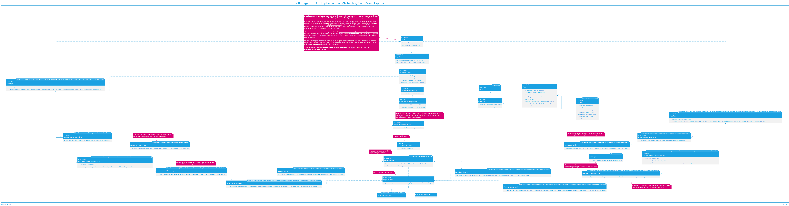

Follow CQRS Pattern
-------------------

**Status**: Accepted

### Context

Regardless of the size of a project, it is best to have an architecture approach that works well enough with what the project proposes to do. In this case it is about tracking expenses and investments, eventually having the ability to generate reports.

After experimenting with a number of patterns, [Command and Query Responsibility Segragation](https://learn.microsoft.com/azure/architecture/patterns/cqrs) (CQRS) pattern should be a good fit as the application is implemented as a classic multi-page application. There is no need for a front-end framework as the amount of JavaScript that runs in the browser is kept at an absolute minimum. This moves the entire processing on the back-end where an operation is carried out and then the result is rendered in an HTML view and sent to the browser.

Each operation is performed either for an HTML GET request (default verb used when accessing a web page from the browser) or an HTML POST request (generally used when submitting a form). This maps to queries and commands in a more specific way. Each GET request is a query and each POST request is a command. This provides a clear separation between the two and indicates that a GET request should never change domain data in the database. The reason why domain data is used, rather than data in general, is because through GET requests the session of a user can be validated and potentially cleared if their session has expired, another example would be tracking user application usage through Azure Application Insights. This means changing data in the database, but neither are domain data. No changes are made to the tracked expenses or user profile information through a GET request. This is only possible through a POST request.

This distinction is critical as browsers do not implicitly perform a POST request when accessing a website, making it more difficult to simply send links that would harm user data. It's an extra layer of security. The only way to perform such requests is either through the submission of a form or by making a request explicitly from a specialized application/executable such as [Postman](https://www.postman.com/) or [`Invoke-WebRequest`](https://learn.microsoft.com/powershell/module/microsoft.powershell.utility/invoke-webrequest).

### Decision

Follow the [Command and Query Responsibility Segregation](https://learn.microsoft.com/azure/architecture/patterns/cqrs) (CQRS) pattern abstracting the [Express](https://expressjs.com/) web middleware, making it easy to implement pages as well as configuring request handles for a specific page.

Each page has a unique route, implicitly route parameters, view options (parameters used by the view engine when rendering a view, in this case Handlebars) and request body (applicable only to POST requests). This will simplify the definition of pages as well as helping them remain concise and address a single concern.

Queries are associated with GET HTTP requests while commands are associated with POST HTTP requests. Through the body of the request a command can be specified, this will handle the scenario when a page can perform multiple commands, such as editing and deleting an item. The same page performs both acctions, however the distinction between the command handlers is made by the command that is specified which leads to having two different command handlers, each responsible with one operation. This will keep the code clean and expandable.

The [CQRS](https://learn.microsoft.com/azure/architecture/patterns/cqrs) implementation should make use of the [Express](https://expressjs.com/) middleware and abstract it in a way that when implementing request handlers there is no dependency on [Express](https://expressjs.com/). Some of the concepts will be present, such as route parameters, query parameters, request body as well as possible results (render or redirect), however these are web application specific and not [Express](https://expressjs.com/) specific. How these values or request results are interpreted can vary depending on the underlying framework.

### Consequences

One benefit is that the code becomes more clear. There is complete type safety and possibility of adding dependency injection at the request handler level making them small, isolated and testable.

Adding features should be relatively easy as the page configuration can be enhanced and the code that configures pages to [Express](https://expressjs.com/) middleware can be updated to cover for these features. On the other hand this means more abstractions and more indirection that has the capability of leading to clutter and over-engineering.

A drawback is that through the abstraction, the use of other libraries that enhance the [Express](https://expressjs.com/) web middleware is more limtied. For instance, [express-validator](https://www.npmjs.com/package/express-validator) cannot be just added because it is tightly couple to [Express](https://expressjs.com/).